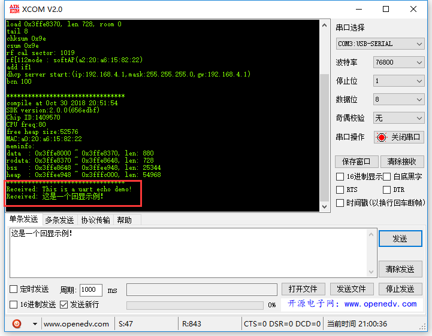

# uart_echo_app

ESP8266使用UART回显数据示例。

## 说明

本例是使用UART进行简单的回显示例。代码是从empty_app示例复制过来并进行修改。

本例主要模块如下：

- `driver/uart.c`
- `include/driver/uart.h`
- `user/user_main.c`

### `uart.h`

首先看`uart.h`文件，找到下面宏定义，35行。把下面的宏定义由`0`改为`1`使能。

```C
// 把下面两个宏定义设置为1
#define UART_BUFF_EN  1   //use uart buffer  , FOR UART0
#define UART_SELFTEST  1  //set 1:enable the loop test demo for uart buffer, FOR UART0
```

- `UART_BUFF_EN`表示缓冲区使能。
- `UART_SELFTEST`本意是自测（self test），这里直接借用。

### `uart.c`

然后转向`uart.c`，找到下面代码，在273行。

```C
#if UART_SELFTEST & UART_BUFF_EN
os_timer_t buff_timer_t;
void ICACHE_FLASH_ATTR
uart_test_rx() {
	uint8 uart_buf[128] = { 0 };
	uint16 len = 0;
	len = rx_buff_deq(uart_buf, 128);	// 从rx接收数据存到缓存区uart_buf
	// tx_buff_enq(uart_buf, len);	// 把 uart_buf 放到tx发送队列
	if (len > 0) {
		uint8 *pStr = "Received: ";
		tx_buff_enq(pStr, os_strlen(pStr));
		tx_buff_enq(uart_buf, len);	// 把 uart_buf 放到tx发送队列
	}
}
#endif
```

`uart_test_rx()`是一个定时器回调函数，`rx_buff_deq()`函数意思是从uart的rx缓冲区队列提取数据，至于怎么实现的，有空的时候我会在代码里进行注释。`tx_buff_enq()`则是把数据发送到uart的tx缓冲区队列，从而输出到UART0。


下面看看这个定时在哪初始化，Ctrl+F搜索`uart_test_rx`：

```C
void ICACHE_FLASH_ATTR
uart_init(UartBautRate uart0_br, UartBautRate uart1_br) {
    // ...
    // 344行
#if UART_SELFTEST & UART_BUFF_EN
	// 每隔10ms调用一次uart_test_rx
	os_timer_disarm(&buff_timer_t);
	os_timer_setfn(&buff_timer_t, uart_test_rx, NULL); //a demo to process the data in uart rx buffer
	os_timer_arm(&buff_timer_t, 10, 1);
#endif
}
```

可以看到该定时器在`uart_init()`函数里初始化了，因此我们必须在`user_init()`里调用该函数才能成启动。

```C
// user_main.c
// ...
void ICACHE_FLASH_ATTR
user_init(void) {
	uart_init(BIT_RATE_74880, BIT_RATE_74880);
	//uart_init(BIT_RATE_115200, BIT_RATE_115200);
	system_init_done_cb(init_done_cb_init);
}
```

## 效果图



