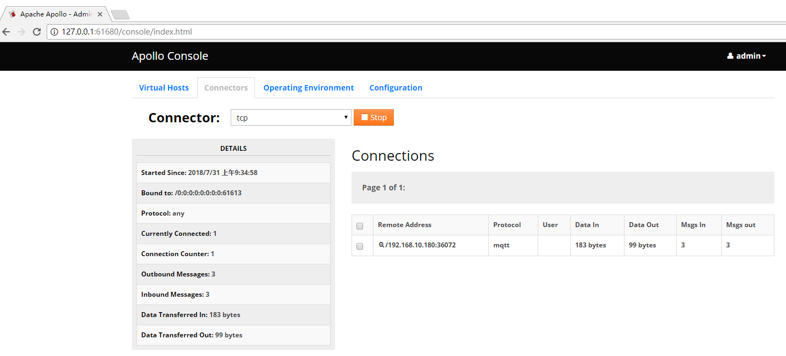

# mqtt_app

fork form https://github.com/espressif/ESP8266_NONOS_SDK/tree/master/examples/esp_mqtt_proj

从官方SDK`examples`目录下fork过来的MQTT项目，并根据某些场景添加了一些功能或做一些修改。目前主要增加以下功能

- smartconfig_connect功能：可以以smartconfig方式进行wifi配网。
- 增大`SYSCFG`某些数组大小：增加`include/modules/config.h/SYSCFG`结构体成员中的`mqtt_host`、`device_id`、`mqtt_user`和`mqtt_pass`数组大小，确保有足够的空间存放阿里云IoT生成的mqtt信息。

相关技术博客：https://blog.csdn.net/yannanxiu/article/details/53088534


## 成功打印

连接到MQTT Broker后，可以看到以下信息

```
SDK ver: 2.0.0(656edbf) compiled @ Jul 19 2016 17:58:40
phy ver: 1055, pp ver: 10.2


load ...
 default configuration
MQTT_InitConnection
MQTT_InitClient

System started ...
mode : sta(5c:cf:7f:f7:99:6f)
add if0
SC version: V2.5.4
[INFO] smartconfig start!
scandone
scandone
SC_STATUS_FIND_CHANNEL
wifi_smartconfig_timer_cb
[INFO] smartconfig stop!
wifi ssid:<WIFI_SSID> 
wifi pass:<WIFI_PASS> 
[INFO] WiFi_LED_STATUS_TIMER_ENABLE
scandone
state: 0 -> 2 (b0)
state: 2 -> 3 (0)
state: 3 -> 5 (10)
add 0
aid 2
cnt 

connected with <WIFI_SSID>, channel 1
dhcp client start...
ip:192.168.10.180,mask:255.255.255.0,gw:192.168.10.1
TCP: Connect to ip  192.168.10.168:61613
MQTT: Connected to broker 192.168.10.168:61613
MQTT: Sending, type: 1, id: 0000
TCP: Sent
TCP: data received 4 bytes
MQTT: Connected to 192.168.10.168:61613
MQTT: Connected
MQTT: queue subscribe, topic"/mqtt/topic/0", id: 1
MQTT: queue subscribe, topic"/mqtt/topic/1", id: 2
MQTT: queue subscribe, topic"/mqtt/topic/2", id: 3
MQTT: queuing publish, length: 23, queue size(66/2048)
MQTT: queuing publish, length: 25, queue size(91/2048)
MQTT: queuing publish, length: 25, queue size(118/2048)
MQTT: Sending, type: 8, id: 0001
TCP: Sent
MQTT: Sending, type: 8, id: 0002
TCP: data received 5 bytes
TCP: Sent
TCP: data received 5 bytes
MQTT: Subscribe successful
MQTT: Sending, type: 8, id: 0003
TCP: Sent
TCP: data received 5 bytes
MQTT: Subscribe successful
MQTT: Sending, type: 3, id: 0000
TCP: Sent
MQTT: Published
TCP: data received 22 bytes
Receive topic: mqtt/topic/0, data: hello0 
MQTT: Sending, type: 3, id: 0004
TCP: Sent
MQTT: Published
TCP: data received 26 bytes
Receive topic: mqtt/topic/1, data: hello1 
Get another published message
TCP: data received 4 bytes
MQTT: received MQTT_MSG_TYPE_PUBACK, finish QoS1 publish
MQTT: Sending, type: 3, id: 0005
TCP: Sent
MQTT: Published
TCP: data received 26 bytes
Receive topic: mqtt/topic/2, data: hello2 
Get another published message
TCP: data received 4 bytes
MQTT: Sending, type: 6, id: 0005
TCP: Sent
TCP: data received 4 bytes
pm open,type:2 0

```

## mqtt broker后台图


