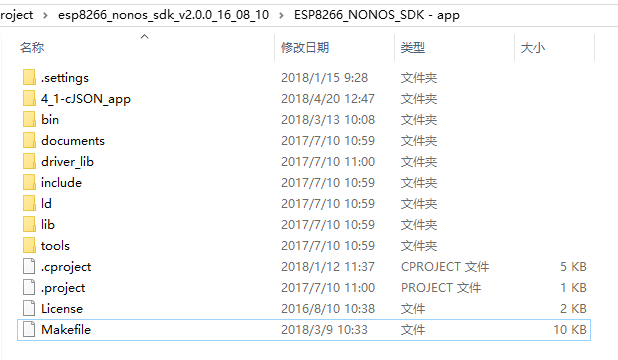

# ESP8266-Demos

ESP8266示例工程集合，基于ESP8266_NONOS_SDKv3.0.0。

## 使用指南

建议把本仓库当作一个代码实现参考的地方，有需要即可拷贝移植。也可以用`O00-empty_app`空白工程作为基础模板，需要什么功能再进行添加。

## 系列说明

**D系列**：与编码（Decode）相关的demo，加密和哈希相关的也会放在这里。

| 序号 | 工程名称 | 说明 |
|---|---|---|
| D01 | cjson_app | 使用cJSON示例 |
| D02 | base64_app | base64编码示例 |
| D03 | md5_app | ESP8266使用MD5进行Hash |

**H系列**：与ESP8266片上硬件（Hardware）资源相关的demo，部分demo会有外设使用实例。

| 序号 | 工程名称 | 说明 |
|---|---|---|
| H01 | gpio_app | 定时设置GPIO和GPIO的中断处理函数 |
| H02 | iic_app | IIC使用示例 |
| H03 | spi_app | SPI使用示例，支持HARD_SPI和SOFT_SPI |
| H04 | adc_app| 定时读取ADC数值 |
| H05 | hw_timer_app | ESP8266使用硬件中断定时器示例 |
| H06 | ir_app | IR接口示例 |
| H07 | uart_app | UART回显示例 |

**N系列**：与ESP8266网络（Network）相关的demo。

| 序号 | 工程名称 | 说明 |
|---|---|---|
| N00 | speed_test_app | ESP8266 TCP/UDP速率测试 |
| N01 | tcp_ssl_client_app | TCP和SSL客户端示例 |
| N02 | tcp_udp_server_app | TCP和UDP服务器示例 |
| N03 | http_client_app | ESP8266作为http client示例 |
| N04 | coap_app | 搭建一个简单的CoAP Server |
| N05 | sntp_app | SNTP使用示例工程 |
| N06 | esp_now_app | ESP-NOW使用示例，分为slave和controller两部分 |
| N07 | smartconfig_app | 简单SmartConfig示例 |
| N08 | smartconfig_wifi_app | 上电先SmartConfig，一段时间后WiFi连接 |
| N09 | sniffer_app | sniffer使用示例 |
| N10 | wifi_event_cb_app | 连接Wi-Fi后回调事件功能 |
| N11 | multiudp_server_app | UDP多播 |
| N12 | mqtt_app | MQTT client 实例，基于官方SDK example下面的esp_mqtt_proj工程 |

**O系列**：其他（Other）demo，未分类的都放在这里。

| 序号 | 工程名称 | 说明 |
|---|---|---|
| O00 | empty_app | 空白工程 |
| O01 | upgrade_app |  远程更新固件示例 |
| O02 | lwip_open_src_template_proj | 官网提供的lwip示例工程，添加了一些个人示例代码 |


部分app文件夹下有说明文件（README.md）和效果图（screenshot）。


## 本人所用的开发环境

- Windows 10
- [安信可 ESP 系列一体化开发环境](http://wiki.ai-thinker.com/ai_ide_install)（基于 Windows + Cygwin + Eclipse + GCC 的综合 IDE 环境，以下简称ESP8266 IDE）
- NodeMCU（ESP8266 4MB flash）


## 使用步骤

1. 首先到[github](https://github.com/espressif/ESP8266_NONOS_SDK)或者[官网](http://espressif.com/zh-hans/products/hardware/esp8266ex/resources)下载SDK；
2. 然后下载并拷贝相关工程文件夹（比如cjson_app）到主目录，用法类似于ESP8266_NONOS_SDK/examples里面的工程；
3. ESP8266 IDE导入该SDK，，如果不熟悉该环境，参考[这里](http://wiki.ai-thinker.com/ai_ide_use)；
4. 使用SDKv3.0.0还需要修改该SDK的顶层Makefile。编辑器打开该SDK的顶层Makefile，找到下面配置变量，修改`SPI_SIZE_MAP`为4（如果是使用32Mbit Flash）。

	```Makefile
	# ...
	# 25行
	BOOT?=none
	APP?=0
	SPI_SPEED?=40
	SPI_MODE?=QIO
	SPI_SIZE_MAP?=4
	```

	如果不修改，后面编译会报下面错误：

	```
	#error "The flash map is not supported"
	```

5. 最后编译下载即可（建议先clean）。




## 烧写bin

这一步对新手来说可能坑比较多。可参考安信可的[烧写步骤](http://wiki.ai-thinker.com/esp_download#%E7%83%A7%E5%BD%95%E4%B8%8B%E8%BD%BD)，也可参考我[ESP8266-Demos](https://github.com/AngelLiang/ESP8266-Demos)仓库里[wiki](https://github.com/AngelLiang/ESP8266-Demos/wiki)的烧写说明（目前待完善）。

对老手来说，平时怎么烧写就怎么烧写。


## 注意事项

- 关于串口波特率

    ESP8266串口波特率打印默认为74800bps。

- 关于中文乱码

    因为源码文件编码默认为UTF-8，而Windows Eclipse IDE默认为GBK，所以可能需要设置一下：

    菜单栏Window -> Preferences -> General -> Workspace -> 面板Text file encoding -> 选择UTF-8 -> OK


## 基于SDKv2.0.x的app移植到SDKv3.0.0步骤说明

环境同样还是安信可 ESP 系列一体化开发环境，只不过是把原本基于ESP8266_NONOS_SDKv2.x.x的app兼容到SDKv3.0.0。

### 第一步：下载SDKv3.0.0

到乐鑫官方的github下载SDK：

https://github.com/espressif/ESP8266_NONOS_SDK

### 第二步：导入该SDK

这个就不赘述了。

### 第三步：修改该SDK的顶层Makefile

编辑器打开该SDK的顶层Makefile，找到下面配置变量，修改`SPI_SIZE_MAP`为4（如果是使用32Mbit Flash）。

```Makefile
# ...
# 25行
BOOT?=none
APP?=0
SPI_SPEED?=40
SPI_MODE?=QIO
SPI_SIZE_MAP?=4
```

### 第四步：修改`user_main.c`文件

我参考了SDKv3.0.0的`examples/IoT_Demo/user_main.c`代码，并根据官方文档的说明。使SDKv2.x的app能兼容SDKv3.0.0，仅仅是需要拷贝下面代码到`user_main.c`即可：

```C
#if ((SPI_FLASH_SIZE_MAP == 0) || (SPI_FLASH_SIZE_MAP == 1))
#error "The flash map is not supported"
#elif (SPI_FLASH_SIZE_MAP == 2)
#define SYSTEM_PARTITION_OTA_SIZE                           0x6A000
#define SYSTEM_PARTITION_OTA_2_ADDR                         0x81000
#define SYSTEM_PARTITION_RF_CAL_ADDR                        0xfb000
#define SYSTEM_PARTITION_PHY_DATA_ADDR                      0xfc000
#define SYSTEM_PARTITION_SYSTEM_PARAMETER_ADDR              0xfd000
#define SYSTEM_PARTITION_CUSTOMER_PRIV_PARAM_ADDR           0x7c000
#elif (SPI_FLASH_SIZE_MAP == 3)
#define SYSTEM_PARTITION_OTA_SIZE                           0x6A000
#define SYSTEM_PARTITION_OTA_2_ADDR                         0x81000
#define SYSTEM_PARTITION_RF_CAL_ADDR                        0x1fb000
#define SYSTEM_PARTITION_PHY_DATA_ADDR                      0x1fc000
#define SYSTEM_PARTITION_SYSTEM_PARAMETER_ADDR              0x1fd000
#define SYSTEM_PARTITION_CUSTOMER_PRIV_PARAM_ADDR           0x7c000
#elif (SPI_FLASH_SIZE_MAP == 4)
#define SYSTEM_PARTITION_OTA_SIZE                           0x6A000
#define SYSTEM_PARTITION_OTA_2_ADDR	                        0x81000
#define SYSTEM_PARTITION_RF_CAL_ADDR                        0x3fb000
#define SYSTEM_PARTITION_PHY_DATA_ADDR                      0x3fc000
#define SYSTEM_PARTITION_SYSTEM_PARAMETER_ADDR				0x3fd000
#define SYSTEM_PARTITION_CUSTOMER_PRIV_PARAM_ADDR           0x7c000
#elif (SPI_FLASH_SIZE_MAP == 5)
#define SYSTEM_PARTITION_OTA_SIZE							0x6A000
#define SYSTEM_PARTITION_OTA_2_ADDR							0x101000
#define SYSTEM_PARTITION_RF_CAL_ADDR						0x1fb000
#define SYSTEM_PARTITION_PHY_DATA_ADDR						0x1fc000
#define SYSTEM_PARTITION_SYSTEM_PARAMETER_ADDR				0x1fd000
#define SYSTEM_PARTITION_CUSTOMER_PRIV_PARAM_ADDR           0xfc000
#elif (SPI_FLASH_SIZE_MAP == 6)
#define SYSTEM_PARTITION_OTA_SIZE                            0x6A000
#define SYSTEM_PARTITION_OTA_2_ADDR                          0x101000
#define SYSTEM_PARTITION_RF_CAL_ADDR                         0x3fb000
#define SYSTEM_PARTITION_PHY_DATA_ADDR                       0x3fc000
#define SYSTEM_PARTITION_SYSTEM_PARAMETER_ADDR               0x3fd000
#define SYSTEM_PARTITION_CUSTOMER_PRIV_PARAM_ADDR            0xfc000
#else
#error "The flash map is not supported"
#endif

#define SYSTEM_PARTITION_CUSTOMER_PRIV_PARAM                SYSTEM_PARTITION_CUSTOMER_BEGIN

uint32 priv_param_start_sec;

static const partition_item_t at_partition_table[] = {
    { SYSTEM_PARTITION_BOOTLOADER, 						0x0, 												0x1000},
    { SYSTEM_PARTITION_OTA_1,   						0x1000, 											SYSTEM_PARTITION_OTA_SIZE},
    { SYSTEM_PARTITION_OTA_2,   						SYSTEM_PARTITION_OTA_2_ADDR, 						SYSTEM_PARTITION_OTA_SIZE},
    { SYSTEM_PARTITION_RF_CAL,  						SYSTEM_PARTITION_RF_CAL_ADDR, 						0x1000},
    { SYSTEM_PARTITION_PHY_DATA, 						SYSTEM_PARTITION_PHY_DATA_ADDR, 					0x1000},
    { SYSTEM_PARTITION_SYSTEM_PARAMETER, 				SYSTEM_PARTITION_SYSTEM_PARAMETER_ADDR, 			0x3000},
    { SYSTEM_PARTITION_CUSTOMER_PRIV_PARAM,             SYSTEM_PARTITION_CUSTOMER_PRIV_PARAM_ADDR,          0x1000},
};

void ICACHE_FLASH_ATTR user_pre_init(void)
{
    if(!system_partition_table_regist(at_partition_table, sizeof(at_partition_table)/sizeof(at_partition_table[0]),SPI_FLASH_SIZE_MAP)) {
		os_printf("system_partition_table_regist fail\r\n");
		while(1);
	}
}
```

### 第五步：完成，尝试编译烧写吧！

自此，基于SDKv2.x的app已经能在SDKv3.0上编译了。我测试了我的部分示例app，烧写后一切正常工作。
